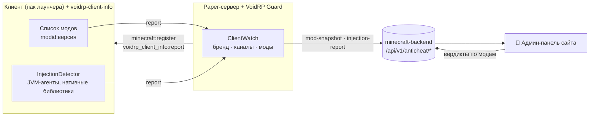
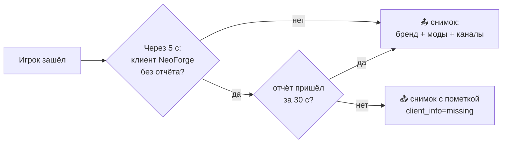

<p align="center"></p>

<div align="center">


[](https://github.com/VOIDRP-MINECRAFT/voidrp-client-info/actions/workflows/build.yml)


</div>

> Клиентский NeoForge-мод VoidRP для серверов на плагинах: сообщает серверу список модов клиента
> и проверку на инжекты в JVM, чтобы античит видел, с чем игрок зашёл.

---

## 🗺️ Место в экосистеме



---

## ✨ Возможности

- **Список модов клиента** — все моды с версиями (`sodium:0.9.2+mc26.2`), а не только те, у которых есть
  сетевые каналы. Вердикты по модам в админке работают по `modid`, как на сервере с модами.
- **Проверка на инжекты** — JVM-агенты в командной строке и нативные библиотеки с именами известных читов
  (тот же `InjectionDetector`, что в `voidrp-anticheat`).
- **Не мешает входу** — пакет необязательный: клиент заходит на любой сервер, и туда, где канал никто не
  слушает, ничего не отправляется.
- **Ждёт сервер** — Paper-плагин объявляет канал чуть позже входа (а клиент может ещё грузить ресурспак),
  поэтому мод проверяет канал раз в полсекунды до минуты и шлёт отчёт один раз за подключение.

### Как Guard собирает снимок



---

## 📋 Требования

| Minecraft | NeoForge | Java | Где ставится |
|---|---|---|---|
| 26.2 | 26.2.0.88+ | 25 | только клиент (пак лаунчера) |

На сервере нужен **VoidRP Guard ≥ 0.3.0** — он слушает канал и передаёт отчёт в бэкенд. В паке лаунчера мод
скрытый и обязательный: в списке модов игрок его не видит.

---

## 🚀 Сборка

```bash
./gradlew jar      # build/libs/voidrp_client_info-1.0.0+mc26.2.jar
```

---

## 📦 Формат отчёта

Канал `voidrp_client_info:report` (клиент → сервер), читается в Guard (`ClientWatch`):

| Поле | Тип |
|---|---|
| версия формата | VarInt (`1`) |
| моды | VarInt-счётчик + строки UTF-8 (VarInt-длина) |
| JVM-агенты | то же |
| подозрительные библиотеки | то же |
| агенты найдены | 1 байт |

Отчёт укладывается в 30 000 байт: огромный список модов обрезается, а не теряется.

---

## 🔗 Связанные репозитории

| Репо | Связь |
|---|---|
| [voidrp-guard](https://github.com/VOIDRP-MINECRAFT/voidrp-guard) | Принимает отчёт на Paper-сервере и отправляет в бэкенд |
| [voidrp-anticheat](https://github.com/VOIDRP-MINECRAFT/voidrp-anticheat) | То же для серверов на NeoForge (свой `ModListPayload`) |
| [minecraft-backend](https://github.com/VOIDRP-MINECRAFT/minecraft-backend) | Принимает `/anticheat/mod-snapshot` и `/anticheat/injection-report` |
| [voidrp-site](https://github.com/VOIDRP-MINECRAFT/voidrp-site) | Админ-панель: снимки клиентов, вердикты по модам |

---

<div align="center">
<a href="https://void-rp.ru">🌐 Сайт</a> ·
<a href="https://github.com/VOIDRP-MINECRAFT">🏠 Организация</a>
</div>
